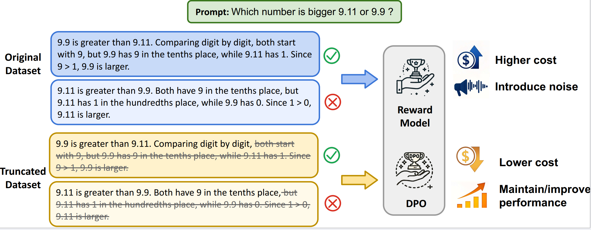

# Shallow Preference Signals: Efficient Large Language Model Alignment with Truncated Data

This repository contains the code and models for the work presented in the paper "**Shallow Preference Signals: Efficient Large Language Model Alignment with Truncated Data**". In this work, we investigate the concept of shallow preference signals, showing that human preferences in language model outputs are often concentrated in the early part of the response rather than being evenly distributed. We explore how truncating responses at various points can significantly improve the efficiency of preference-based optimization methods like Reinforcement Learning from Human Feedback (RLHF) and Direct Preference Optimization (DPO).

<figure>
  
  <figcaption>An example illustrating the phenomenon of shallow preference signals. It demonstrates how the relative quality of two responses can be determined from the early portion of the response, or even from the first sentence. Training with only the initial part allows the model to capture most of the preference signals while conserving resources.</figcaption>
</figure>

## Overview

In the domain of large language model alignment, preference-based optimization methods like RLHF and DPO rely heavily on human-annotated datasets. Our research reveals that the majority of the distinguishing signals between high-quality and low-quality responses are found in the early tokens of the response, a phenomenon we call **shallow preference signals**.

By focusing on this early portion of responses, we show that models can achieve comparable or even superior performance with truncated datasets, drastically reducing training and inference costs.

### Key Contributions:
1. **Shallow Preference Signals**: We demonstrate that preference signals are often concentrated in the early portion of responses.
2. **Truncation for Efficiency**: Models trained on truncated datasets (retaining only the first half or fewer tokens of each response) perform similarly or better than models trained on full responses.
3. **Efficient Training and Decoding**: We propose novel decoding strategies and optimized reward-KL divergence trade-offs that leverage shallow preference signals.

## Setup Instructions

Clone this repository to your local machine:

```bash
git clone https://github.com/your-repo/shallow-preference-signals.git
cd shallow-preference-signals
conda create -n shallow_pref python=3.9
conda activate shallow_pref
pip install torch==2.4.0 torchvision==0.19.0 torchaudio==2.4.0 --index-url https://download.pytorch.org/whl/cu124
pip install -r requirements.txt
```

## How to Reproduce Our Experiments

We have provided all the necessary scripts and configurations to reproduce the experiments discussed in our paper. The core process involves truncating preference datasets, training reward models, and fine-tuning models using DPO.

### Data Preprocessing
You can preprocess the preference datasets and create truncated versions using the provided script:

```bash
python src/preprocess.py --input_dir /path/to/input_dataset --output_dir /path/to/output_dataset --truncate_ratio 50
```

This will create a truncated dataset retaining 50% of the response tokens.

### Experiment: Truncation Effects on Reward Models and DPO

#### Training Reward Models and DPO models
For training the reward model and fine-tuning the model with DPO, we referred to [RLHFlow](<https://github.com/RLHFlow/RLHF-Reward-Modeling/tree/main/bradley-terry-rm>) and [OpenRLHF](<https://github.com/OpenRLHF/OpenRLHF>), using the default parameters from each.

#### Evaluate Models with RewardBench and Alpaca-Eval
For testing the model performance on rewardbench and alpaca-eval, we referred to [rewardbench](<https://github.com/allenai/reward-bench>) and [alpaca-eval](<https://github.com/tatsu-lab/alpaca_eval>), using the default evaluation sets. The model responses generated for alpaca-eval can be done as follows:

```bash
python src/get_model_response.py --model_path /path/to/model --model_name name_of_model_in_alpaca-eval
```

### Experiment: KL Divergence and Reward-KL Tradeoff for Evaluating Response Quality

#### KL Divergence Across Token Positions

##### Using default model paths
```bash
python src/experiment_6.1.py --dataset ultrafeedback --a 0.5
```

##### Specifying all parameters
```bash
python src/experiment_6.1.py --dpo_model_path /path/to/dpo_model --ref_model_path /path/to/ref_model --reward_model_path /path/to/reward_model --dataset alpaca --a 0.5 --num_samples 1
```

#### Reward-KL Tradeoff for Length Control and KL Threshold Control Decoding

##### Length Control

```bash
python src/experiment_6.2_length.py --dataset ultrafeedback --t_values 5 10 15
```

##### Threshold Control

```bash
python src/experiment_6.2_threshold.py --dataset ultrafeedback --threshold_values 0.1 0.5 1.0
```

## Experiment Results

###  RewardBench Results

| Dataset | Dimension | Original Dataset | 50% | 40% | 33% | 25% |
|---------|-----------|------------------|-----|-----|-----|-----|
| **Skywork-Preference** | Chat | **0.8073** | _0.7318_ | 0.7039 | 0.5866 | 0.5978 |
|  | Chat-Hard | _0.7039_ | **0.7105** | 0.6974 | 0.6776 | 0.6732 |
|  | Safety | **0.8216** | 0.8068 | 0.7946 | _0.8162_ | 0.8030 |
|  | Reasoning | 0.7043 | _0.7769_ | **0.8101** | 0.7064 | 0.7450 |
|  | Total | 0.7585 | _0.7588_ | **0.7635** | 0.7000 | 0.6992 |
| **UltraFeedback** | Chat | 0.7946 | **0.8098** | _0.8073_ | 0.7844 | 0.7644 |
|  | Chat-Hard | 0.6029 | **0.6425** | _0.6342_ | 0.5983 | 0.5946 |
|  | Safety | 0.7416 | _0.7632_ | **0.7848** | 0.7384 | 0.6756 |
|  | Reasoning | **0.7056** | _0.6904_ | 0.6682 | 0.6886 | 0.5646 |
|  | Total | **0.7391** | _0.7327_ | 0.7194 | 0.7018 | 0.6355 |
| **RLHFlow-Preference** | Chat | **0.9553** | _0.9302_ | 0.9287 | 0.8574 | 0.8291 |
|  | Chat-Hard | _0.4517_ | **0.4561** | 0.4506 | 0.4323 | 0.4127 |
|  | Safety | **0.6730** | _0.6621_ | 0.6438 | 0.5985 | 0.6081 |
|  | Reasoning | 0.5984 | **0.8374** | _0.7894_ | 0.6247 | 0.5723 |
|  | Total | 0.6596 | **0.7216** | _0.6971_ | 0.6244 | 0.5562 |

Performance of reward models trained on different truncation ratios for various datasets. The table presents the evaluation scores across multiple dimensions from the RewardBench core set: **Chat**, **Chat-Hard**, **Safety** and **Reasoning**. **Total** is the final score on the RewardBench core set. **Skywork-Preference** refers to Skywork-Reward-Preference-80K-v0.2 dataset, **UltraFeedback** refers to ultrafeedback-binarized dataset, **RLHFlow-Preference** refers to RLHFlow-pair-data-v2-80K-wsafety dataset. **Original Dataset** refers to the model trained on the full dataset without truncation; **50%**, **40%**, **33%**, and **25%** refer to datasets where the responses are truncated to retain 50%, 40%, 33%, and 25% of the original token length, respectively. The highest score in each row is indicated in **bold**, and the second-highest score is indicated with _italics_.

###  Evaluation of Reward Models on Each Task of UltraFeedbac

| Task | Original Dataset | 50% | 40% | 30% | 20% | 10% |
|------|------------------|-----|-----|-----|-----|-----|
| Helpfulness | 0.89 | **0.90** | **0.90** | 0.87 | 0.82 | 0.73 |
| Honesty | _0.87_ | **0.88** | _0.87_ | 0.84 | 0.79 | 0.76 |
| Instruction Following | **0.91** | **0.91** | 0.86 | 0.87 | 0.74 | 0.69 |
| Truthfulness | **0.85** | _0.84_ | _0.84_ | 0.83 | 0.81 | 0.64 |
| Average | _0.88_ | **0.8825** | 0.87 | 0.855 | 0.795 | 0.705 |

UltraFeedback test accuracy across different tasks with various truncation ratios. The table presents the test accuracy for each task in the UltraFeedback dataset, with different truncation ratios: **Original Dataset** refers to the model evaluated on the full, unmodified UltraFeedback dataset; **50%**, **40%**, **30%**, **20%**, and **10%** refer to models evaluated using truncated versions of the dataset, where the response portion is truncated to 50%, 40%, 30%, 20%, and 10% of the original length, respectively. The tasks listed include: **Helpfulness**, **Honesty**, **Instruction Following**, and **Truthfulness**. **Average** represents the mean accuracy across all tasks for each truncation ratio. The highest score in each row is indicated in **bold**, and the second-highest score is indicated with _italics_.

### DPO Fine-tuned Model Performance

| Metric | Llama3.1 8B | Original Dataset | 50% | 40% | 33% | 25% |
|--------|-------------|------------------|-----|-----|-----|-----|
| LCWR | 21.45 | _24.90_ | **25.19** | 24.85 | 23.51 | 21.13 |
| WR | 22.37 | _23.92_ | **24.15** | 23.57 | 23.43 | 20.96 |

Performance of DPO models with different truncation ratios. The table presents the evaluation metrics for both the original model and the DPO models trained on truncated datasets: **Llama3.1 8B** refers to the original Llama-3.1-8B-Instruct model; **Original Dataset** refers to the Llama-3.1-8B-Instruct model fine-tuned using the full Skywork-Reward-Preference-80K-v0.2 dataset with the DPO algorithm; **50%**, **40%**, **33%**, and **25%** refer to models fine-tuned using truncated versions of the dataset, where the response portion is truncated to 50%, 40%, 33%, and 25% of the original length, respectively. **LCWR** refers to Length-controlled Win Rate and **WR** refers to Win Rate. The highest score in each row is indicated in **bold**, and the second-highest score is indicated with _italics_.


